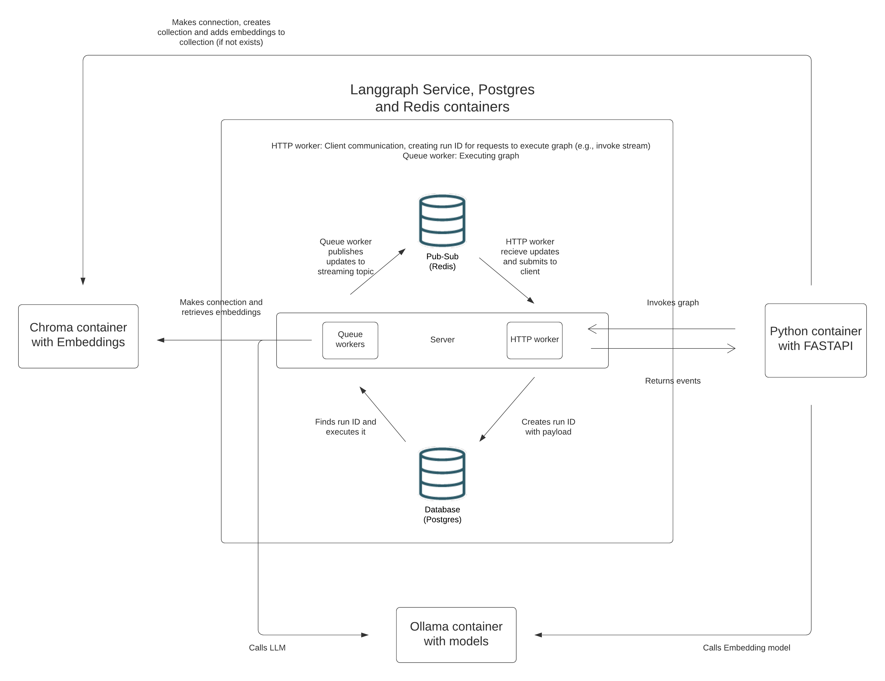
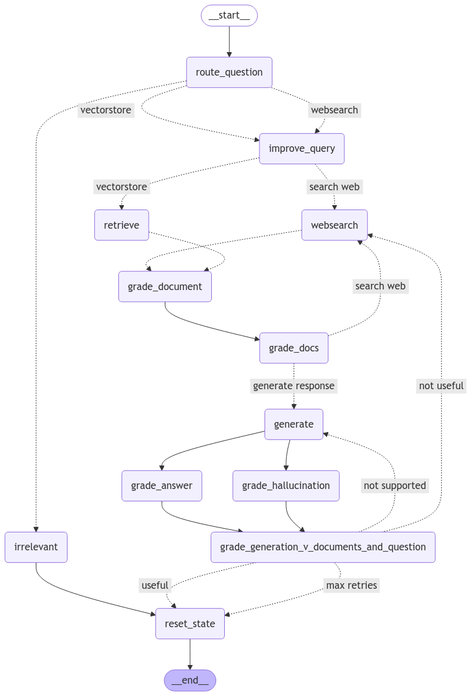

# Chatbot Service

## Project Overview

This project focuses on developing a chatbot service that answers questions about the game **Rummikub**. The chatbot is
built using advanced techniques, including **Retrieval-Augmented Generation (RAG)**, to deliver accurate and
context-aware responses.

> **Retrieval Augmented Generation (RAG)** is a powerful technique that enhances language models by combining them with
> external knowledge bases. RAG addresses a key limitation of models: reliance on fixed training datasets, which can
> lead
> to outdated or incomplete information. When given a query, RAG systems first search a knowledge base for relevant
> information. The system then incorporates this retrieved information into the model's prompt. The model uses the
> provided context to generate a response to the query. By bridging the gap between vast language models and dynamic,
> targeted information retrieval, RAG is a powerful technique for building more capable and reliable AI systems.
> *(Retrieval Augmented Generation (RAG) | 🦜️🔗 LangChain, n.d.)*

### Research and Development

The development of the chatbot involved extensive research and experimentation, which is documented in the `research`
directory.  
This directory is organized into two sections:

- **Exploration Notebooks**: Focused on investigating different aspects of chatbot design and functionality.
- **Improvement Notebooks**: Dedicated to optimizing the chatbot's performance and architecture.

### Technology Stack

- **LangGraph**: The primary framework used to design and implement the chatbot.
- **LangChain**: A backup solution for simpler deployment scenarios, ensuring flexibility if LangGraph deployment was
  not approved.
- Upon receiving approval from the DevOps team, the chatbot was built but sadly not deployed.

### Key Features

The chatbot incorporates several advanced techniques to enhance its capabilities:

- **Routing**: Directing queries to appropriate modules or data sources.
- **Fallback Mechanisms**: Handling exceptions and edge cases effectively.
- **Self-Correction**: Dynamically refining responses based on intermediate evaluations.

These features are explained in the research notebooks.

### FastAPI Application

To deploy the chatbot, we developed a **FastAPI** application.  
The application, located in the `app` directory, provides two REST API endpoints for:

1. Querying the chatbot.
2. Managing the embeddings.

## Running the Project

### Setting Up the Project

To get started with the project, follow the instructions below depending on whether you want to run the notebooks, the
FastAPI app locally, or in Docker.

#### 1. **Running the Notebooks and Full Project**

To run the notebooks and experiment with the full project, you'll need to install the required dependencies.

1. Clone the repository.
2. Navigate to the project directory.
3. Install the required dependencies:

   ```bash
   pip install -r requirements-full-project.txt
   ```

4. You will need to install Ollama. You can find the installation instructions [here](https://ollama.com/download).
5. Check if you have tesseract and poppler installed. These are required for the OCR functionality in the notebooks.
6. Depending on what notebooks you want to run, you might need to install some LLMs depending on the notebook.
   You can install the models using the following command:

   ```bash
   ollama install <model_name>
   ```

All models used in the entire project are listed below:

- llama3.2:3b
- llava-llama3
- nomic-embed-text
- llama3.1:8b
- mistral:7b
- mxbai-embed-large
- llama3.2:3b-instruct-fp16

7. You will need a `.env.research` file in the root folder that contains the same environment variables as the
   `.env.example.research` file. This example file is the most complete and will work for the whole project.

#### 2. **Running the FastAPI App Locally**

If you want to run the FastAPI application locally (without Docker), follow these steps:

1. Install the required dependencies:

   ```bash
   pip install -r requirements.txt
   ```

2. Create a `.env.development` file in the root folder that contains the same environment variables as the
   `.env.example` file.
3. Ensure you have Docker and Docker Compose installed on your system as this is required for the LangGraph service.

4. You need to run the docker-compose file in the `infrastructure` directory. Don't run the chatbot-service as this will
   start the FastAPI application. This will start the LangGraph service and all the other necessary services.

    ```bash
    docker-compose up -d
    ```
5. Run the FastAPI application in the root folder:

On Linux/Mac:

   ```bash
   export ENVIRONMENT=development && uvicorn app.main:app --reload
   ```

On Windows (CMD):

   ```bash
   set ENVIRONMENT=development; uvicorn app.main:app --reload
   ```

This will start the FastAPI application on `http://127.0.0.1:8000`.

#### 3. **Running the FastAPI App in Docker**

If you prefer to run the FastAPI application in Docker, you can use the provided Docker Compose setup.

1. Ensure you have Docker and Docker Compose installed on your system.
2. Navigate to the `infrastructure` folder in the project directory.
3. Create a `.env.production` file in the `infrastructure` folder that contains the same environment variables as the
   `.env.example` file.
4. Run the following command to start the FastAPI application in Docker:

   ```bash
    docker-compose up -d
    ```

This will start the FastAPI application on `http://127.0.0.1:8000`.

### Endpoints

At the moment, there are two endpoints available. One endpoint creates a new thread, which is essentially a new chat.
The other endpoint sends a message to the chatbot.

- **POST** `/api/chatbot/thread`

  This endpoint creates a new thread. There is no request body required for this endpoint.

  The endpoint returns a JSON response with the thread ID:

   ```json
   {
     "thread_id": "9d40cf65-f00b-4bcc-8b34-cc61df6559b0"
   }
   ```
- **POST** `/api/chatbot`

  This endpoint sends a message to the chatbot. The request body should contain the thread ID and the message.

   ```json
   {
     "thread_id": "9d40cf65-f00b-4bcc-8b34-cc61df6559b0",
     "question": "What is a joker tile?"
   }
   ```

  The endpoint will return a JSON response with the answer and thread_id:

   ```json
   {
     "answer": "A joker tile is a tile that can be used as a substitute for any other tile in the game.",
     "thread_id": "9d40cf65-f00b-4bcc-8b34-cc61df6559b0"
   }
   ```

## Container layout



## Chatbot layout

